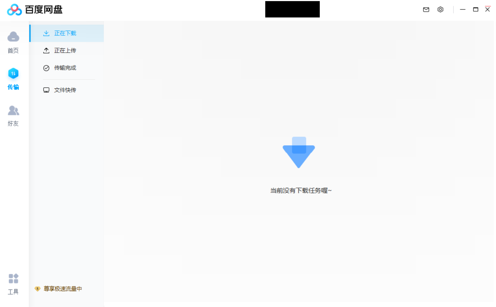

# BaiduNetdisk-Remove-AD
去除百度网盘广告。

⭐使用：下载 duiengineskin.zip 替换掉自己本地的。

## 0 主要修改

本地百度网盘存储位置：C:\Users\UserName\AppData\Roaming\baidu\BaiduNetdisk\skin 里的 duiengineskin.zip

每个人的安装位置不一样，注意选择正确路径。

## 1 各文件说明

### 1.1 删除传输栏下方广告

修改：

C:\Users\UserName\AppData\Roaming\baidu\BaiduNetdisk\skin\duiengineskin\xml\MainPanel\TransPanel\TransLeftPanel.xml 

### 1.2 删除上方广告

修改：

C:\Users\UserName\AppData\Roaming\baidu\BaiduNetdisk\skin\duiengineskin\xml\MainPanel\TitlePanel.xml

只保留用户头像和昵称。

### 1.3 关闭自动更新

防止升级后修改的文件丢失

【需手动】将 C:\Users\UserName\AppData\Roaming\baidu\BaiduNetdisk 中的\AutoUpdate文件更名。

## 2 效果

黑框只在本README中起遮挡信息作用。

